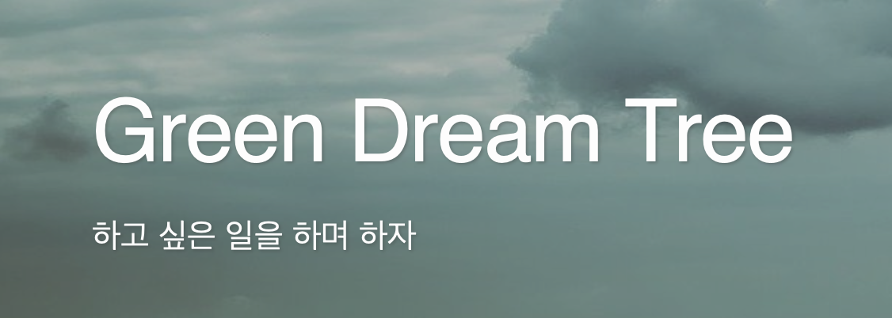

# 😆 Enjoy your development ‼️

---

# 💻 In Use

![JavaScript][JavaScript Icon]
![Vue.js][Vue.js Icon]
![HTML5][HTML5 Icon]
![CSS3][CSS3 Icon]

![Java][Java Icon]
![Spring][Spring Icon]
![Spring Boot][Spring Boot Icon]

![PostgreSQL][PostgreSQL Icon]

# 📚 In Learning

![Swift][Swift Icon]
![SwiftUI][SwiftUI Icon]

![React][React Icon]
![TypeScript][TypeScript Icon]
![SCSS][SCSS Icon]
![Tailwind CSS][Tailwind CSS Icon]

---

# 👀 Experience

![Angular][Angular Icon]
![.NET][.NET Icon]
![Classic ASP][Classic ASP Icon]
![Node.js][Node.js Icon]
![Python][Python Icon]

![Docker][Docker Icon]
![Azure DevOps][Azure DevOps Icon]
![AWS EC2][AWS EC2 Icon]
![Raspberry Pi][Raspberry Pi Icon]

![Oracle][Oracle Icon]
![MySQL][MySQL Icon]
![Microsoft SQL Server][Microsoft SQL Server Icon]

![OWASP][OWASP Icon]

---

# 🪪 Licenses

- 정보처리기사
- SQLD

---

# 📝 Blog

[![GitHub Blog][GitBlog Icon]][My Blog]

# 📩 Contact

[![Gmail Badge][Gmail Icon]][My Email]

<!--
설정 참고 사이트 : https://soo-vely-dev.tistory.com/159

Hits
Markdown : 
HTML : 
EMBED(Notion) : https://hits.seeyoufarm.com/api/count/incr/badge.svg?url=https%3A%2F%2Fgithub.com%2Fsbpark88&count_bg=%2379C83D&title_bg=%23555555&icon=&icon_color=%231A447E&title=hits&edge_flat=false
-->

<!--
Icons
![HTML5][HTML5 Icon]
![CSS3][CSS3 Icon]
![SCSS][SCSS Icon]
![Tailwind CSS][Tailwind CSS Icon]
![JavaScript][JavaScript Icon]
![TypeScript][TypeScript Icon]
![RxJS][RxJS Icon]
![Webpack][Webpack Icon]
![Vite][Vite Icon]
![React][React Icon]
![Angular][Angular Icon]
![Vue.js][Vue.js Icon]
![Java][Java Icon]
![Spring][Spring Icon]
![Spring Boot][Spring Boot Icon]
![Swift][Swift Icon]
![SwiftUI][SwiftUI Icon]
![RxSwift][RxSwift Icon]
![.NET][.NET Icon]
![Classic ASP][Classic ASP Icon]
![Node.js][Node.js Icon]
![Python][Python Icon]
![Docker][Docker Icon]
![Azure DevOps][Azure DevOps Icon]
![AWS EC2][AWS EC2 Icon]
![Raspberry Pi][Raspberry Pi Icon]
![Oracle][Oracle Icon]
![PostgreSQL][PostgreSQL Icon]
![MySQL][MySQL Icon]
![Microsoft SQL Server][Microsoft SQL Server Icon]
![OWASP][OWASP Icon]
![AWS Lambda][AWS Lambda Icon]

[![GitHub Blog][GitBlog Icon]][My Blog]
[![Gmail Badge][Gmail Icon]][My Email]
-->

[HTML5 Icon]:https://img.shields.io/badge/HTML5-E34F26.svg?&style=for-the-badge&logo=HTML5&logoColor=white
[CSS3 Icon]:https://img.shields.io/badge/CSS3-1572B6.svg?&style=for-the-badge&logo=CSS3&logoColor=white
[SCSS Icon]:https://img.shields.io/badge/Scss-CC6699.svg?&style=for-the-badge&logo=Sass&logoColor=white
[Tailwind CSS Icon]:https://img.shields.io/badge/Tailwind_CSS-06B6D4.svg?&style=for-the-badge&logo=TailwindCSS&logoColor=white
[JavaScript Icon]:https://img.shields.io/badge/JavaScript-F7DF1E.svg?&style=for-the-badge&logo=JavaScript&logoColor=white
[TypeScript Icon]:https://img.shields.io/badge/TypeScript-3178C6.svg?&style=for-the-badge&logo=TypeScript&logoColor=white
[RxJS Icon]:https://img.shields.io/badge/RxJS-A22846.svg?&style=for-the-badge&logo=ReactiveX&logoColor=white
[Webpack Icon]:https://img.shields.io/badge/Webpack-8DD6F9.svg?&style=for-the-badge&logo=Webpack&logoColor=white
[Vite Icon]:https://img.shields.io/badge/Vite-646CFF.svg?&style=for-the-badge&logo=Vite&logoColor=white
[Angular Icon]:https://img.shields.io/badge/Angular-DD0031.svg?&style=for-the-badge&logo=Angular&logoColor=white
[React Icon]:https://img.shields.io/badge/React-61DAFB.svg?&style=for-the-badge&logo=React&logoColor=white
[Vue.js Icon]:https://img.shields.io/badge/Vue.js-4FC08D.svg?&style=for-the-badge&logo=Vue.js&logoColor=white
[Java Icon]:https://img.shields.io/badge/Java-007396.svg?&style=for-the-badge&logo=Java&logoColor=white
[Spring Icon]:https://img.shields.io/badge/Spring-6DB33F.svg?&style=for-the-badge&logo=Spring&logoColor=white
[Spring Boot Icon]:https://img.shields.io/badge/Spring_Boot-6DB33F.svg?&style=for-the-badge&logo=SpringBoot&logoColor=white
[Swift Icon]:https://img.shields.io/badge/Swift-F05138.svg?&style=for-the-badge&logo=Swift&logoColor=white
[SwiftUI Icon]:https://img.shields.io/badge/SwiftUI-3178C6.svg?&style=for-the-badge&logo=Swift&logoColor=white
[RxSwift Icon]:https://img.shields.io/badge/RxSwift-A22846.svg?&style=for-the-badge&logo=ReactiveX&logoColor=white
[.NET Icon]:https://img.shields.io/badge/.NET-512BD4.svg?&style=for-the-badge&logo=dotnet&logoColor=white
[Classic ASP Icon]:https://img.shields.io/badge/Classic_ASP-339933.svg?&style=for-the-badge&logo=dotent&logoColor=white
[Node.js Icon]:https://img.shields.io/badge/Node.js-339933.svg?&style=for-the-badge&logo=node.js&logoColor=white
[Python Icon]:https://img.shields.io/badge/Python-3776AB.svg?&style=for-the-badge&logo=Python&logoColor=white
[Docker Icon]:https://img.shields.io/badge/Docker-2496ED.svg?&style=for-the-badge&logo=Docker&logoColor=white
[Azure DevOps Icon]:https://img.shields.io/badge/Azure_DevOps-0078D7.svg?&style=for-the-badge&logo=azuredevops&logoColor=white
[AWS EC2 Icon]:https://img.shields.io/badge/Aws_EC2-FF9900.svg?&style=for-the-badge&logo=amazonec2&logoColor=white
[Raspberry Pi Icon]:https://img.shields.io/badge/Raspberry_Pi-A22846.svg?&style=for-the-badge&logo=RaspberryPi&logoColor=white
[Oracle Icon]:https://img.shields.io/badge/Oracle-F80000.svg?&style=for-the-badge&logo=Oracle&logoColor=white
[PostgreSQL Icon]:https://img.shields.io/badge/PostgreSQL-4169E1.svg?&style=for-the-badge&logo=PostgreSQL&logoColor=white
[MySQL Icon]:https://img.shields.io/badge/MySQL-4479A1.svg?&style=for-the-badge&logo=MySQL&logoColor=white
[Microsoft SQL Server Icon]:https://img.shields.io/badge/Microsoft_SQL_Server-4479A1.svg?&style=for-the-badge&logo=MicrosoftSQLServer&logoColor=white
[OWASP Icon]:https://img.shields.io/badge/OWASP-000000.svg?&style=for-the-badge&logo=OWASP&logoColor=white
[AWS Lambda Icon]:https://img.shields.io/badge/Aws_Lambda-FF9900.svg?&style=for-the-badge&logo=amazonaws&logoColor=white

[GitBlog Icon]:http://img.shields.io/badge/GitHub_Blog-181717?style=flat-square&logo=github&logoColor=white
[My Blog]:https://sbpark88.github.io
[Gmail Icon]:https://img.shields.io/badge/Gmail-EA4335?style=flat-square&logo=Gmail&logoColor=white
[My Email]:mailto:devsbipa@gmail.com
